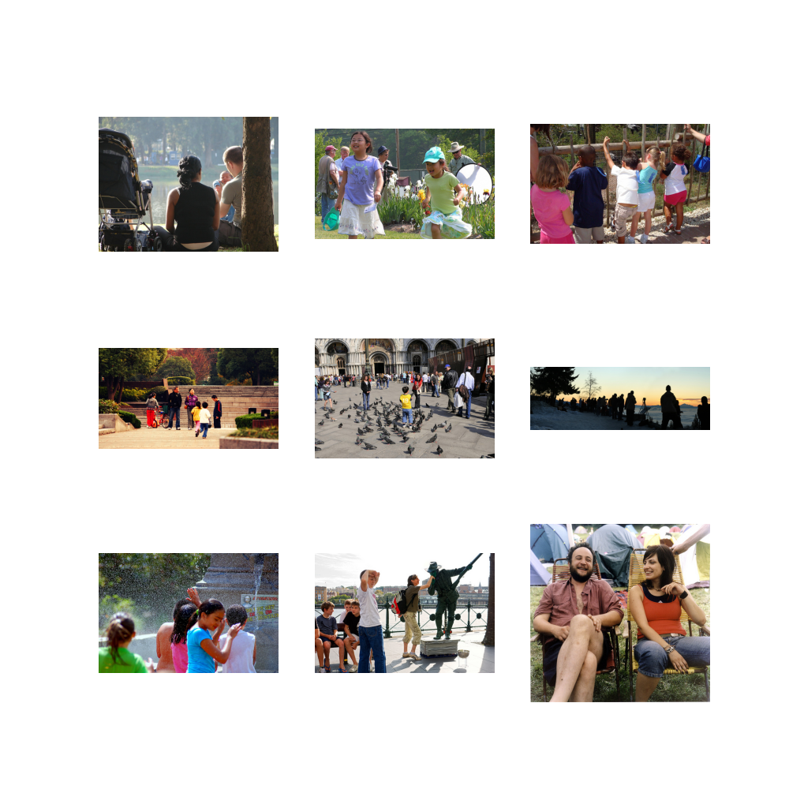

# Simple CLIP (CLIP from Scratch)

CLIP stands for Contrastive Language Image Pre-training. CLIP model learns the association between images and captions. The model can be used to retrieve images given a text and to classify images.  

Followed the [OpenAI-CLIP](https://github.com/moein-shariatnia/OpenAI-CLIP) tutorial. Original CLIP paper is [here](https://arxiv.org/abs/2103.00020). 

Added tests to improve understanding of the model components. Downloaded `flicker-8k` data from [here](https://www.kaggle.com/datasets/adityajn105/flickr8k). 

## Running 

```sh
# Package installation
pip3 install -r requirements.txt

# Training and inference 
python3 simple_clip.py

# Test
pytest
```

## Result

Training a few epochs gives sufficiently good results. Each epoch takes about 5 minutes on a P100 GPU. 

**Query**: "People enjoying themselves in a park"  
**Images**:  


## Model Components

* Imports
* Config
* Utils
* Dataset
* Image encoder 
* Text encoder
* Projection head 
* CLIP model 
* Train
* Inference 


**Imports**

* `cv2`: Image load
* `torch`: Training
* `transformers`: `DistilBert` encoding

**Config**

* `Flicker-8k` dataset images and captions path
* `Resnet-50` model 
* Image embedding size 2048, text embedding size 768

**Utils**

* Running average counter

**Dataset**

* Tokenize the sentences with DistilBERT tokenizer. Token ids and attention masks are later fed to DistilBERT.
* Pads/truncates caption to a fixed length. 
* Indexing loads an encoded caption, loads the corresponding image, transforms and augments the image into a tensor.

**Image Encoder**

* Uses Pytorch Image Models Library (timm). Timm provides pretrained/scratch image models such as ResNets and EfficientNets.
* Uses ResNet50 as image encoder. 
* The model encodes each image into a fixed size vector with the size of the model's output channels (2048 in ResNet50). This is the output after `nn.AdaptiveAvgPool2d()` layer.  

**Text Encoder**

* DistilBERT as text encoder. 
* Two special tokens added to actual input tokens: CLS (start) and SEP (end). 
* The whole representation of the sentence is considered as the final representation of CLS token (size 768).

**Projection Head**

* Projects image vectors (size 2048) and text vectors (size 768) into same dimension (size 256). 


**CLIP** 

* Pulls corresponding image-text vectors together and pushes non-relevant image and text pairs far apart. 
* Dot-product among all captions to all image embeddings in a batch are taken as output. 
* There can be same or similar images with close captions in a batch. So, target matrix is formed from image similarity and text similarity matrices in a batch.
* Cross-entropy loss between output and target matrices is calculated. Avegeraged over two directions (one caption vs all image, one image vs all captions).  

```py
CLIP-Loss(batch)
    """Calculates loss for a batch"""

    logits = text_embs DOT image_embs  # (batch_size, batch_size)
    image_sim = image_embs  DOT image_embs # (batch_size, batch_size)
    text_sim = text_embs DOT text_embs # (batch_size, batch_size)
    targets = softmax((image_sim + text_sim) / 2, dim=1) # either dim fine

    text_loss = cross_entropy(logits, targets) # loss for a caption vs all images
    image_loss = cross_entropy(logits.T, targets.T) # loss for an image vs all captions
    loss = (image_loss + text_loss) / 2
    return loss.mean()
```

**Train** 

* Makes train and validation data loaders from images and captions
* Use AdamW optimizer and LR scheduler. Saves model with best loss. 
* Trains image encoder (ResNet50), text encoder (DistilBERT) and projection head. 

**Inference**

* Image embeddings from validation set are used to find matches for a text query. 